# CSAPP - Bomb Lab 筆記

> 紀錄做 Computer Systems: A Programmer's Perspective 的 Bomb Lab 的筆記

## 在 ARM64 MacBook 執行 x86-64 的 Bomb Lab

由於我的 MacBook 是 Apple Silicon M3，是 ARM64 架構，但是這份作業是給一個已經編譯好的 x86-64 可執行檔，而且 debug 過程也需要用 x86-64 組合語言推敲答案。所以首先要先在 ARM64 架構的電腦建立出 x86-64 環境，且可以用 GDB debug。

本來有嘗試許多方法，像是在 VirtualBox 的 Ubuntu 虛擬機內用 `qemu`、`debootstrap`、`chroot` 和 `schroot` 模擬出 x86-64 環境，或者是直接在 MacBook 用 Docker container，但 GDB 的一些功能都有點受限 ＱＱ 最後是用以下這篇的方法直接在 MacBook 用 QEMU 建立 x86-64 的 Ubuntu 虛擬機。

https://slmeng.medium.com/how-to-run-x86-ubuntu-on-macbook-pro-with-silicon-chip-2f6d182424d9

### 1. 下載 x86-64 Ubuntu Server 的 Image

- 至 Ubuntu 官網下載 Ubuntu server 的 Image
- https://ubuntu.com/download/server
- 我這裡下載的是 22.04 的 Server 版本，檔名是 `ubuntu-22.04.5-live-server-amd64.iso`

### 2. MacBook 安裝 QEMU

```shell
$ brew install qemu
```

### 3. 建立 QEMU Virtual Disk Image

先 `cd` 到剛剛下載的 Ubuntu image 的資料夾，然後執行以下指令建立 virtual disk 檔：

```qemu
$ qemu-img create -f qcow2 ubuntu-22.04.5-live-server-amd64.qcow2 50G
```

- `qemu-img`：QEMU 提供的工具，用來建立與操作 virtual disk image
- `create`：建立一個新的 virtual disk 檔
- `-f qcow2`：指定格式為 `qcow2`，這是 QEMU 推薦的格式，支援壓縮（可節省空間）、snapshot、以及動態分配（一開始小，實際寫入才會變大）
- `ubuntu-22.04.5-live-server-amd64.qcow2`：我們要建立的 virtual disk 檔名稱
- `50G`：virtual disk 最大容量 50GB。

### 4. 安裝 x86-64 Ubuntu Server

在同一個資料夾內，執行以下指令以啟動 Ubunt 的安裝，然後就是一般的 Ubuntu 安裝流程（這個安裝的過程很花時間 😵‍💫）：

```qemu
$ qemu-system-x86_64 -machine q35 -m 3000 -smp cores=2 \
  -cdrom ubuntu-22.04.5-live-server-amd64.iso \
  -drive file=ubuntu-22.04.5-live-server-amd64.qcow2,format=qcow2 \
  -device usb-ehci -device usb-kbd -device usb-mouse -usb \
  -net nic -net user \
  -display default
```
- `qemu-system-x86_64`：啟動一個 x86-64 的虛擬機
- `-machine q35`：使用較新的硬體模擬平台（Q35）
- `-m 3000`：分配 3000 MB 記憶體（3GB）（原文作者有提到好像超過 3GB RAM 會有 bug）
- `-smp cores=2`：分配 2 顆虛擬 CPU 核心
- `-cdrom ubuntu-22.04.5-live-server-amd64.iso`：指定用來安裝 Ubuntu 的 iso 檔
- `-drive file=ubuntu-22.04.5-live-server-amd64.qcow2,format=qcow2`：指定前面建立的 virtual disk 檔
- `-device usb-ehci -device usb-kbd -device usb-mouse -usb`：模擬 USB 控制器與鍵盤滑鼠裝置
- `-net nic -net user`：使用 QEMU 的 user 模式網路（內建 NAT，可連外）
- `-display default`：使用預設的 GUI 視窗（會跳出 QEMU 視窗）

### 5. 啟動安裝好的 x86-64 Ubuntu Server

在存放 `.qcow2` 的資料夾內，執行以下指令啟動 QEMU 虛擬機：

```qemu
qemu-system-x86_64 \
  -machine q35 \
  -m 3000 \
  -smp cores=2 \
  -drive file=ubuntu-22.04.5-live-server-amd64.qcow2,format=qcow2 \
  -device usb-ehci \
  -device usb-kbd \
  -device usb-mouse \
  -usb \
  -net nic -net user,hostfwd=tcp::2222-:22 \
  -display default
```
這個指令跟前述步驟指令的差異在於：
- 沒有 `-cdrom` 選項，因為已經不需要再載入安裝的 iso 檔了
- `hostfwd=tcp::2222-:22`：這樣就可以在 MacBook 用 ssh 從 2222 port 連到 QEMU 虛擬機的 port 22


執行以上指令後會跳出 QEMU 的視窗，然後會有 Ubuntu 開機過程等等的畫面，然後會要求輸入 user name 和 password，如下截圖：

<p align=center>
    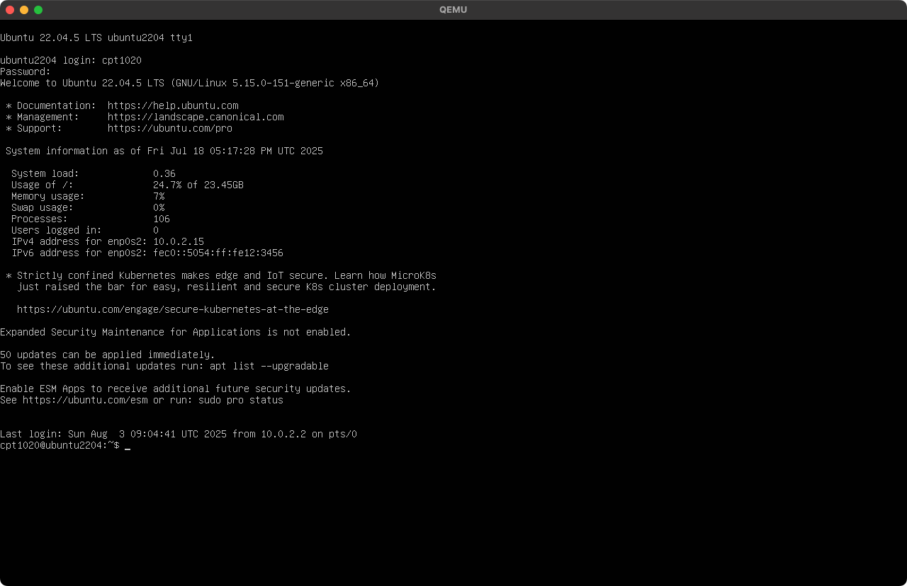
</p>

安裝所需的套件：

```shell
$ sudo apt update
$ sudo apt -y install gcc gdb openssh-server
```

接下來其實可以直接用這個 QEMU 視窗做事情就好了，但我覺得從 MacBook 用 ssh 連過去會比較好用，像是可以直接複製貼上文字之類的～（覺得用那個 QEMU 視窗做事有點不太方便 😵‍💫）

先檢查 Ubuntu 虛擬機的 ssh 有沒有啟動：

```shell
$ sudo systemctl status ssh
```

若沒有啟動，就使用以下指令啟動 ssh：

```shell
$ sudo systemctl start ssh
```

之後在啟動 QEMU 虛擬機時，若不希望跳出 QEMU 視窗，可以把 `qemu-system-x86_64` 指令的 `-display` 選項改成如下，然後再用 ssh 連過去即可：

```qemu
-display none
```

### 6. 用 MacBook 經由 ssh 連過去

用以下指令從 MacBook 的 terminal 用 ssh 連過去：

```shell
$ ssh -p 2222 <user_name>@localhost
```

<p align=center>
    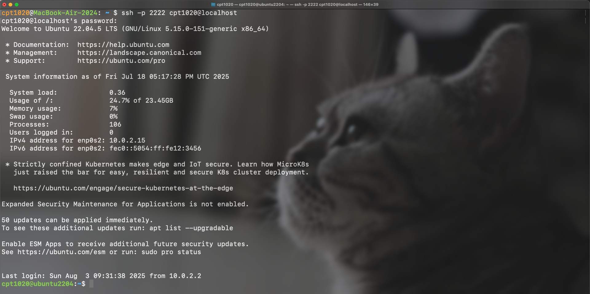
</p>

### 7. 關閉 QEMU 虛擬機

若要關閉 QEMU 虛擬機，用以下指令即可：

```shell
$ sudo shutdown now
```

若要再開啟，就用步驟 5 的指令就可以了～

## 下載 Bomb Lab

https://csapp.cs.cmu.edu/3e/labs.html

<p align=center>
    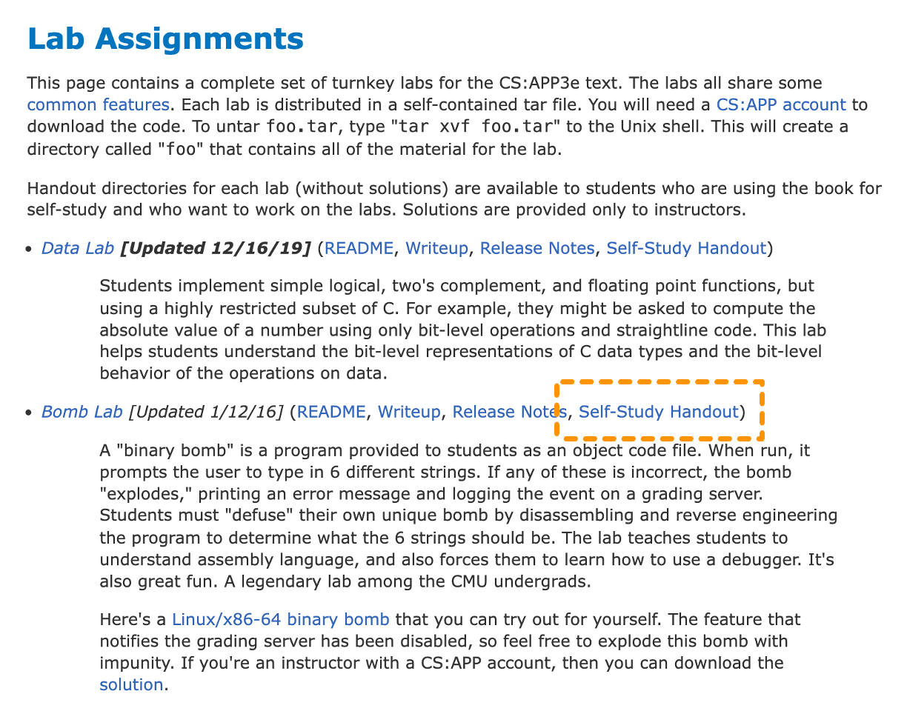
</p>

下載網址：https://csapp.cs.cmu.edu/3e/bomb.tar

先在 MacBook 下載 `bomb.tar`，下載完後在 MacBook 用 `scp` 將檔案傳到 QEMU 的 Ubuntu 虛擬機內：

```shell
$ scp -P 2222 bomb.tar <user_name>@localhost:/home/<user_name>/
```

將前述下載的 `bomb.tar` 解壓縮後會得到一個 `bomb`，裡面的東西如下：

<p align=center>
    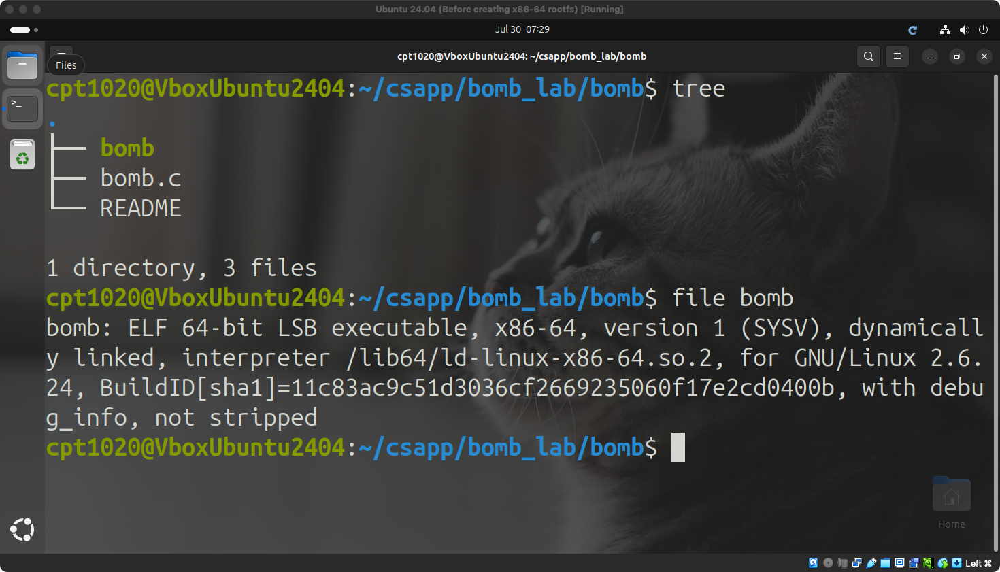
</p>

- 我們可以從 `bomb.c` 看到 `main` 的程式碼是長怎樣
- 而 `bomb` 就是那個可執行檔，可看到是 x86-64 架構的執行檔，且有 `debug_info`，所以可以用 GDB debug～

## GDB 設定

以下 GDB 相關設定是我做這個作業有用到的設定，覺得算是有些幫助～

### 設定 `~/.gdbinit`

可以透過設定 `~/.gdbinit` 檔案為 GDB 做一些客製化的設定。

```gdb
tui new-layout bomb_layout {-horizontal asm 1 regs 1} 3 status 1 cmd 2
define hookpost-run
    layout bomb_layout
end

set disassembly-flavor intel
```

以上設定主要是做：

1. 自定義 TUI（Text User Interface）的 layout，並將這個自定義的 layout 命名成 `bomb_layout`，這個自定義的 layout 畫面如下：
<p align=center>
    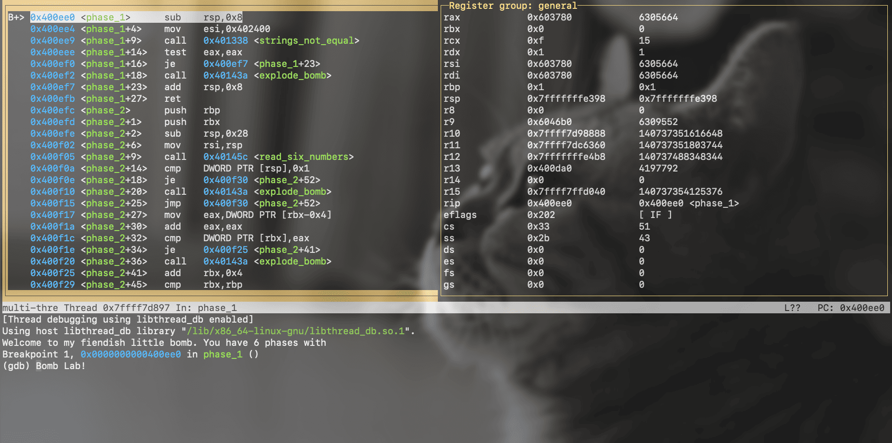
</p>
    - 上半部左側是目前執行到的組合語言，右側則是當前 registers 的值
    - 下半部則是輸入 GDB 指令
    - 可以透過 `focus cmd`、`focus asm`、以及 `focus regs` 指定說目前要 focus 在哪一個 layout
    - 像截圖中組合語言 layout 周圍有一圈淡藍色，就代表是 focus 在組合語言 layout，我們可以用鍵盤的上跟下來移動查看組合語言
2. 將組合語言設定成 Intel 語法
    - GDB 預設是 AT&T 語法，但自己比較習慣 Intel 語法，所以才做這個設定

### 設定 GDB 指令腳本

在做這個作業時，每次用 GDB 開啟 `bomb` 執行檔，可能都會需要輸入一些重複的 GDB 指令，像是設定 break point、啟用自定義的 layout 等等，每次都要輸入相同的指令還滿麻煩的，這時就可以用 GDB 指令腳本～

在跟 `bomb` 執行檔同一個目錄下建立 `bomb.gdb` 檔案，裡面就放你每次開啟 GDB 時都一定會下的 GDB 指令，如：

```gdb
break phase_1
break phase_2
break phase_3
break phase_4
break phase_5
break phase_6
layout bomb_layout
run
```

執行 `GDB` 時就用以下指令執行，他就會馬上依序執行 `bomb.gdb` 內的 GDB 指令：

```shell
$ gdb -x bomb.gdb ./bomb
```

## 用 `objdump` 反組譯

除了用 GDB 看組合語言程式碼，也可以用 `objdump` 先對 `bomb` 做反組譯：

```shell
$ objdump -d -M intel bomb > disasm_bomb.txt
```
- `-d`：對執行檔做 disassemble（反組譯）
- `-M intel`：指定使用 Intel 語法（預設是使用 AT&T 語法，但因為自己比較習慣 Intel 語法所以才做這設定）

## x86-64 組合語言相關

### General-Purpose Registers

<p align=center>
    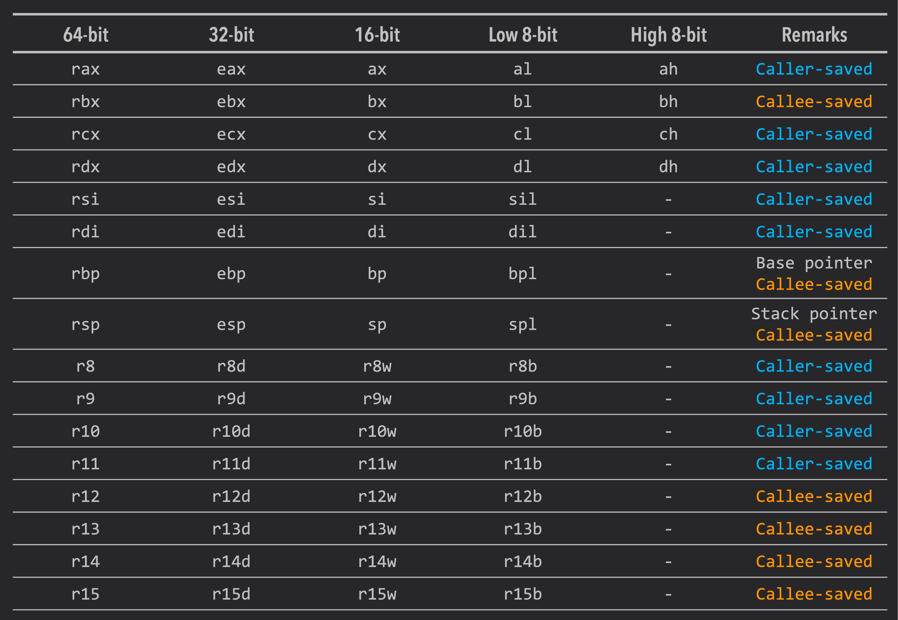
</p>

### Calling Convention

x86-64 Linux 遵循的 calling convention 是 [System V AMD64 ABI](https://en.wikipedia.org/wiki/X86_calling_conventions#System_V_AMD64_ABI)

| Argument Type | Registers |
| -------- | -------- |
| Integer/Pointer Argument 1-6 | 第一個參數至第六個參數分別依序放到以下 registers：<br>`rdi`、`rsi`、`rdx`、`rcx`、`r8`、`r9` |
| Floating Point Argument 1-8 | 浮點數參數則分別放到 `xmm0` - `xmm7` |
| Excess Arguments | 若參數過多，則由 caller 將其他參數 push 到 stack<br>PS. in reverse order, ex. push 10th argument first, then 9th, then 8th, then 7th |
| Static chain pointer | `r10` |

Return value
- 若是 floating point，則放到 `xmm0`
- 若是其他 values（如 integer 或 address），則放到 `rax`

## Bomb Lab 說明

`bomb` 執行後會分成六個階段，`phase_1` 到 `phase_6`，每個階段都要輸入 string，若輸入的 string 是正確的才能到下一個階段，否則就爆炸 🤯

所以我們需要從組合語言來推敲每個階段應該要輸入什麼 string～！

## `phase_1`

<p align=center>
    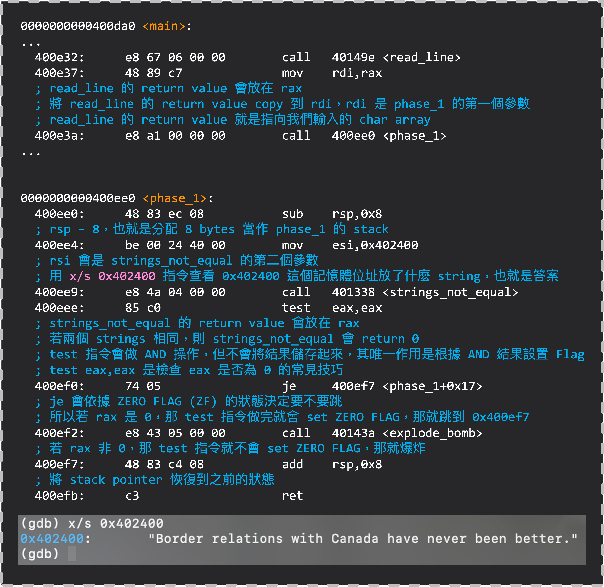
</p>

第一關其實還滿快就可以解出來 🥳

可以看到位在記憶體位址 `0x400ee4` 的組合語言指令：`mov esi,0x402400`，依據 x86-64 的 calling convention（System V AMD64 ABI），`rsi` 是放第二個參數用的，而他下一個指令就是呼叫 `strings_not_equal` function。

用 `x/s` 去檢視一下位在 `0x402400` 這個記憶體位址的 string，就可以看到是 `Border relations with Canada have never been better.`，所以這就是 `phase_1` 的解答～

以下是依據組合語言推敲出來的 `phase_1` C 語言程式碼：

```cpp
void phase_1(char *input) {
    
    if (string_not_equal(input, "Border relations with Canada have never been better.") != 0) {
        explode_bomb();
    }
    
    return;
}
```

## `phase_2`

<p align=center>
    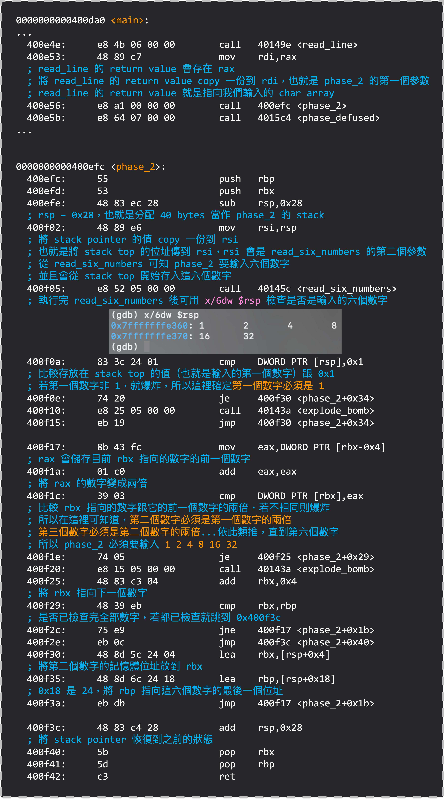
</p>

以下是依據組合語言推敲出來的 `phase_2` C 語言程式碼：

```cpp
void phase_2(char *input) {
    int nums[6];
    read_six_numbers(input, nums);
    
    if (nums[0] != 1) {
        explode_bomb();
    }
    
    int *ptr = nums + 1;
    while (ptr != nums + 6) {
        int prev = *(ptr - 1);
        prev += prev;
        if (*ptr != prev) {
            explode_bomb();
        }
        ptr++;
    }
    
    return;
}
```

## `phase_3`

<p align=center>
    
</p>

<!--  -->

由前述說明可知，`phase_3` 會依據輸入的第一個數字，決定第二個數字應該是多少：

| n1 | n2 | 
| -------- | -------- | 
| 0 | 207 |
| 1 | 311 |
| 2 | 707 |
| 3 | 256 |
| 4 | 389 |
| 5 | 206 |
| 6 | 682 |
| 7 | 327 |

以下是依據組合語言推敲出來的 `phase_3` C 語言程式碼：

```cpp
void phase_3(char *input) {
    int n1, n2;
    int res = sscanf(input, "%d %d", &n1, &n2);
    if (res <= 1) {
        explode_bomb();
    }
    
    if (n1 > 7) {
        explode_bomb();
    }
    
    int tmp;
    switch (n1) {
        case 0:
            tmp = 207;
            break;
        case 1:
            tmp = 311;
            break;
        case 2:
            tmp = 707;
            break;
        case 3:
            tmp = 256;
            break;
        case 4:
            tmp = 389;
            break;
        case 5:
            tmp = 206;
            break;
        case 6:
            tmp = 682;
            break;
        case 7:
            tmp = 327;
            break;
    }
    
    if (n2 != tmp) {
        explode_bomb();
    }
    
    return;
}
```

## `phase_4`

<p align=center>
    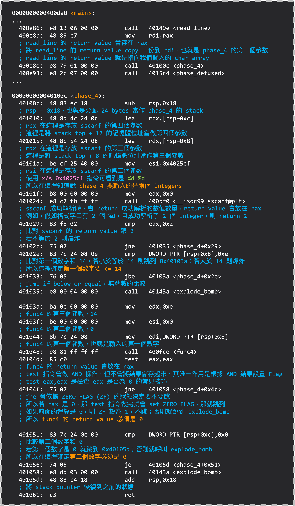
</p>

`func4` 的組合語言如下，並試著推敲出其相對應的 C 語言程式碼：

<p align=center>
    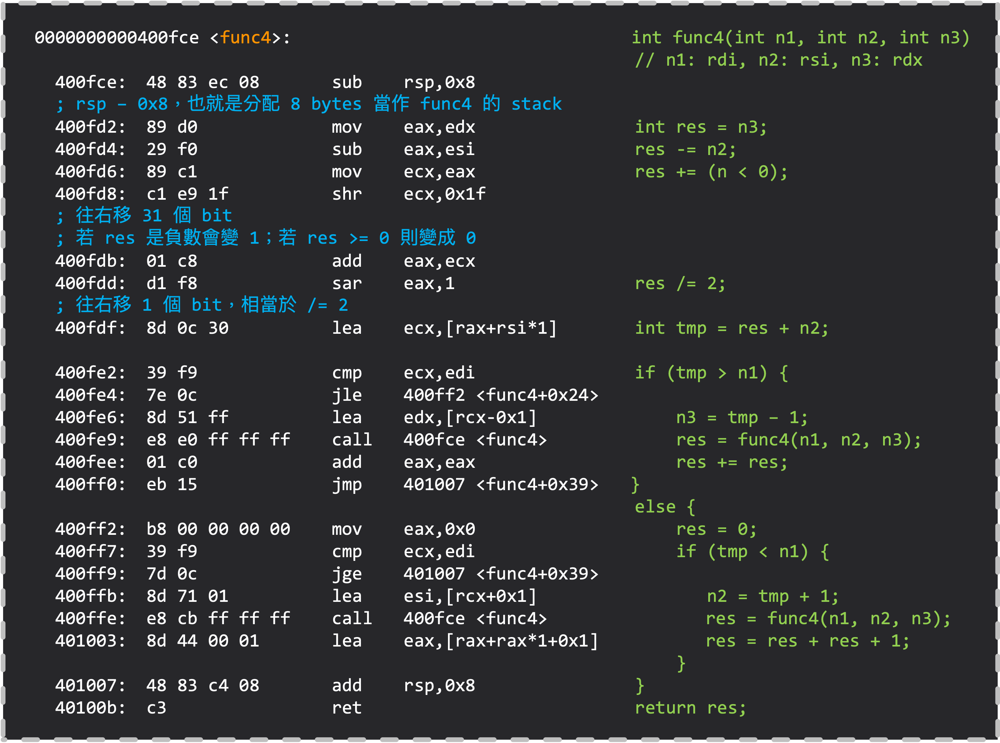
</p>

以下是依據組合語言推敲出來的 `func4` C 語言程式碼：

```cpp
int func4(int n1, int n2, int n3) {
    int res = n3;
    res -= n2;
    res += (res < 0);
    res /= 2;
    int tmp = res + n2;
    if (tmp > n1) {
        n3 = tmp - 1;
        res = func4(n1, n2, n3);
        res += res;
    }
    else {
        res = 0;
        if (tmp < n1) {
            n2 = tmp + 1;
            res = func4(n1, n2, n3);
            res = res + res + 1;
        }
    }
    return res;
}
```

重新整理後，可以發現 `func4` 是在做類似 binary serach 的事情：

```cpp
int func4(int target, int low, int high) {
    int mid = low + ((high - low) >> 1);
    if (mid > target) {
        return func4(target, low, mid - 1) * 2;
    } 
    else if (mid < target) {
        return func4(target, mid + 1, high) * 2 + 1;
    }
    else { // mid == target
        return 0;
    }
}
```

執行以下 C 語言程式碼：

```cpp
#include <stdio.h>

int func4(int n1, int n2, int n3) {
    int res = n3;
    res -= n2;
    res += (res < 0);
    res /= 2;
    int tmp = res + n2;
    if (tmp > n1) {
        n3 = tmp - 1;
        res = func4(n1, n2, n3);
        res += res;
    }
    else {
        res = 0;
        if (tmp < n1) {
            n2 = tmp + 1;
            res = func4(n1, n2, n3);
            res = res + res + 1;
        }
    }
    return res;
}

int main() {
    for (int i = 0; i <= 14; ++i) {
        printf("func4[%d]: %d\n", i, func4(i, 0, 14));
    } 
    return 0;
}
```

執行結果如下：

<p align=center>
    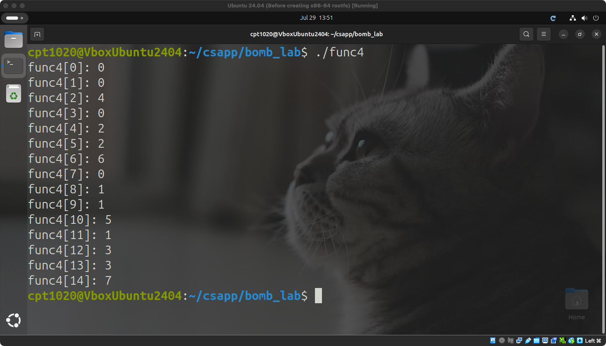
</p>

由於第一個數字必須讓 `func4` return 0，所以從結果可看到第一個數字可以是 `0`、`1`、`3`、`7`。

所以在 `phase_4` 必須輸入兩個數字：
- 第一個數字可以是：`0`、`1`、`3`、`7`
- 第二個數字必須是 `0`

以下是依據組合語言推敲出來的 `phase_4` C 語言程式碼：

```cpp
int func4(int target, int low, int high) {
    int mid = low + ((high - low) >> 1);
    if (mid > target) {
        return func4(target, low, mid - 1) * 2;
    } 
    else if (mid < target) {
        return func4(target, mid + 1, high) * 2 + 1;
    }
    else { // mid == target
        return 0;
    }
}

void phase_4(char *input) {
    int n1, n2;
    int res = sscanf(input, "%d %d", &n1, &n2);
    if (res != 2) {
        explode_bomb();
    }
    
    if (n1 > 14) {
        explode_bomb();
    }
    
    if (func4(n1, 0, 14) != 0) {
        explode_bomb();
    }
    
    if (n2 != 0) {
        explode_bomb();
    }
    
    return;
}
```

## `phase_5`

<p align=center>
    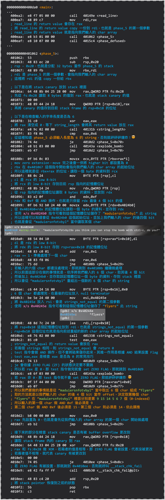
</p>

由前述說明可知，輸入的 6 個 char 在做完 bitwise AND `0xf` 後必須分別得到 9、15、14、5、6、7，所以這六個 char 可以是：

| 第一個 char | 第二個 char | 第三個 char | 第四個 char | 第五個 char | 第六個 char |
| -------- | -------- | -------- | --- | --- | --- |
| `i` | `o` | `n` | `e` | `f` | `g` |
| `y` | `O` | `N` | `u` | `v` | `w` |
| `I` | | | `E` | `F` | `G` |
| `Y` | | | `U` | `V` | `W` |

- 因此這題的答案有滿多組的，像是 `ionefg`、`YOnEVW`、`IonUvG` 等等
- 以上僅列出大小寫英文字母，其他 character 只要能達到同樣目的，也是可以的

以下是依據組合語言推敲出來的 `phase_5` C 語言程式碼：

```cpp
const char *convert = "maduiersnfotvbyl";

void phase_5(char *input) {
    
    if (string_length(input) != 6) {
        explode_bomb();
    }
    
    char new_str[7];
    for (int i = 0; i < 6; ++i) {
        new_str[i] = convert[(input[i] & 0xf)];
    }
    new_str[6] = '\0';
    
    if (strings_not_equal(new_str, "flyers") != 0) {
        explode_bomb();
    }
    
    return;
}
```

## `phase_6`

這一關最難！程式碼一大串 😣

（由於程式碼一大串，圖片做出來 size 太大，所以 `phase_6` 的註解分成三個 part）
（可於新分頁開啟圖片，解析度才會清楚）

<p align=center>
    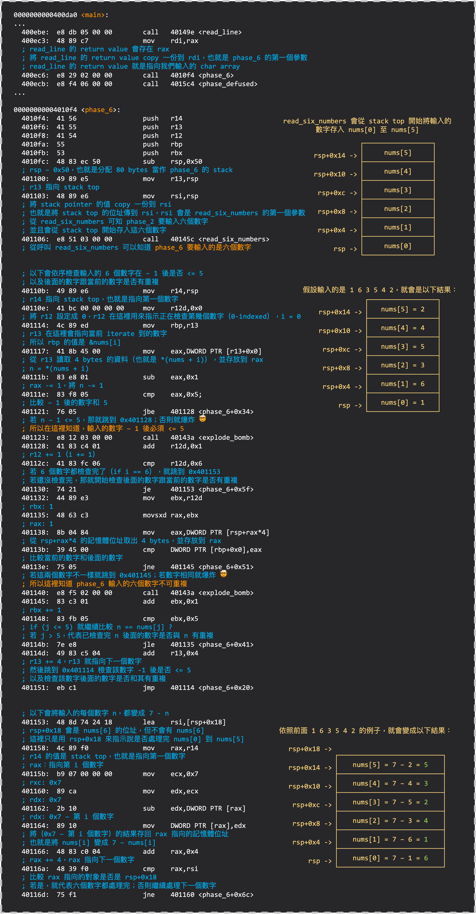
</p>

<p align=center>
    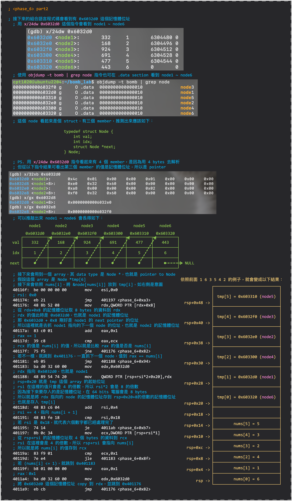
</p>

<p align=center>
    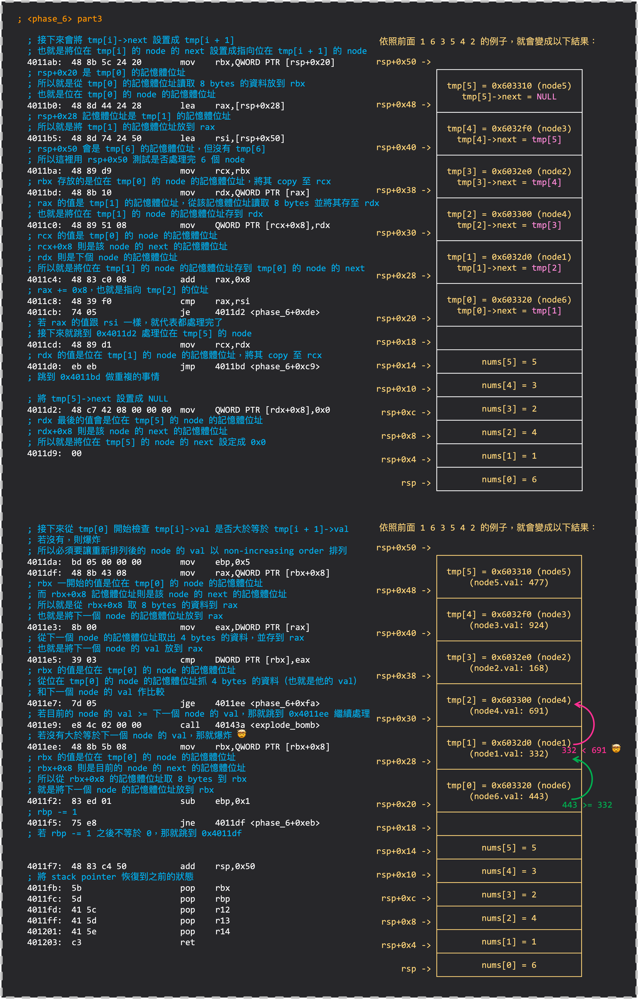
</p>

<p align=center>
    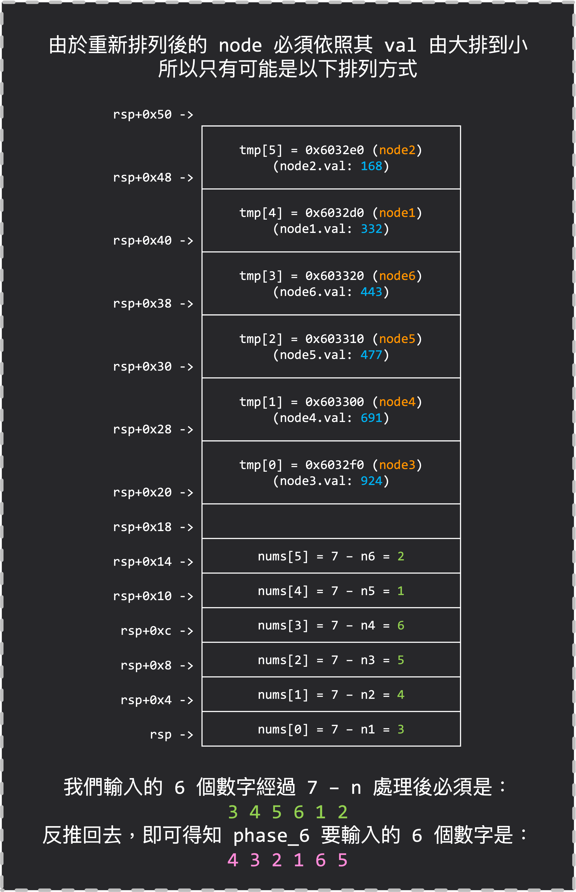
</p>

以下是依據組合語言推敲出來的 `phase_6` C 語言程式碼：

```cpp
typedef struct Node {
    int val;
    int idx;
    struct Node *next;
} Node;

Node nodes[6] = {
    {.val = 332, .idx = 1, .next = &nodes[1]},
    {.val = 168, .idx = 2, .next = &nodes[2]},
    {.val = 924, .idx = 3, .next = &nodes[3]},
    {.val = 691, .idx = 4, .next = &nodes[4]},
    {.val = 477, .idx = 5, .next = &nodes[5]},
    {.val = 443, .idx = 6, .next = NULL}
};

void phase_6(char *input) {
    
    int nums[6];
    Node *tmp[6];
    
    read_six_numbers(input, nums);
    
    for (int i = 0; i < 6 ; ++i) {
        int n = *(nums + i);
        if (n - 1 > 5) {
            explode_bomb();
        }
        
        for (int j = i + 1; j <= 5; ++j) {
            if (n == nums[j]) {
                explode_bomb();
            }
        }
    }
    
    for (int i = 0; i < 6; ++i) {
        nums[i] = 7 - nums[i];
    }
    
    for (int i = 0; i < 6; ++i) {
        int n = nums[i];
        Node *ptr = &nodes[0];
        for (int j = 1; j < n; ++j) {
            ptr = ptr->next;
        }
        tmp[i] = ptr;
    }
    
    for (int i = 0; i < 5; ++i) {
        tmp[i]->next = tmp[i + 1];
    }
    tmp[5]->next = NULL;
    
    for (int i = 0; i < 5; ++i) {
        if (tmp[i]->val < tmp[i + 1]->val) {
            explode_bomb();
        }
    }
    
    return;
}
```
